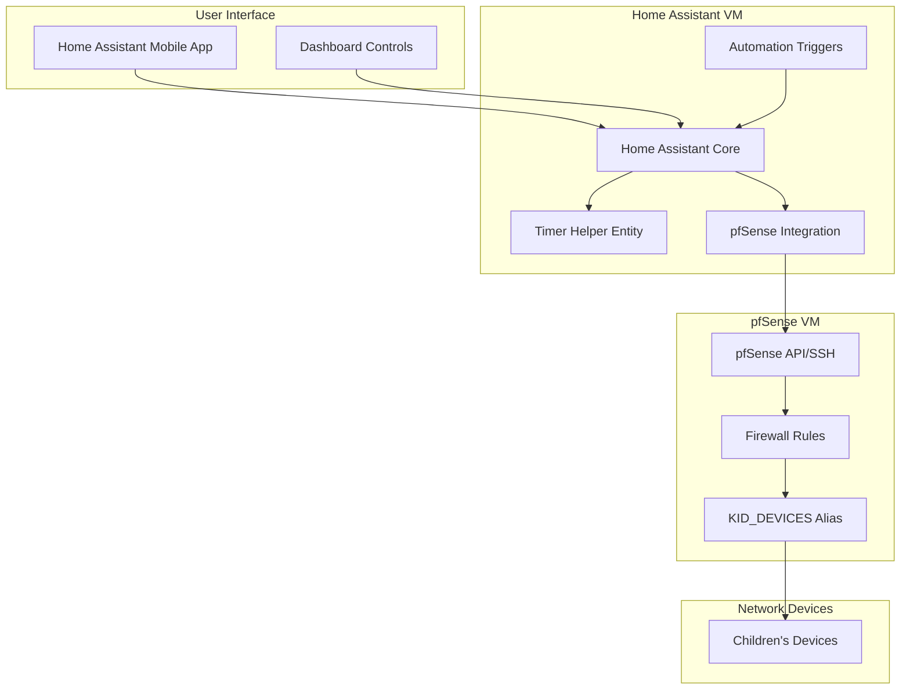

# Parental Control Timer System - Architecture Plan

## Overview
A Home Assistant-integrated timer system that blocks internet access for children's devices after a specified duration, triggered from mobile app.

## System Components

### Current Infrastructure
- **pfSense VM**: Firewall/router on Proxmox
- **Home Assistant VM**: Automation platform on Proxmox  
- **KID_DEVICES alias**: Existing pfSense alias grouping children's device IPs
- **Static DHCP mappings**: MAC-based IP reservations for device identification

### Target Devices
- Android phone
- iPhone  
- iPad
- Nintendo Switch
- Connected via WiFi/Ethernet

## Architecture Overview



## Implementation Plan

### Phase 1: Home Assistant Timer Setup

#### 1.1 Create Timer Helper
- **Entity**: `timer.kids_screen_time`
- **Purpose**: Track remaining time for device access
- **Configuration**: Configurable duration (15min, 30min, 1hr, 2hr options)

#### 1.2 Create Input Helpers
- **Duration Selector**: `input_select.timer_duration`
  - Options: 15min, 30min, 1hr, 2hr, custom
- **Status Tracker**: `input_boolean.kids_devices_blocked`
  - Tracks current blocking state
- **Last Action**: `input_datetime.last_timer_action`
  - Records when timer was last started/stopped

### Phase 2: pfSense Integration

#### 2.1 Integration Method Options
**Option A: pfSense Integration (HACS)**
- Install pfSense integration from HACS
- Configure API access to pfSense
- Direct firewall rule management

**Option B: SSH Command Integration**
- Use SSH command_line platform
- Execute pfSense CLI commands remotely
- More reliable but requires SSH key setup

**Recommended**: Option B (SSH) for reliability

#### 2.2 Firewall Rule Strategy
- **Rule Name**: `BLOCK_KIDS_INTERNET`
- **Action**: Block
- **Source**: KID_DEVICES alias
- **Destination**: WAN networks (any external)
- **Protocol**: Any
- **State**: Disabled by default, enabled by automation

### Phase 3: Home Assistant Automations

#### 3.1 Start Timer Automation
```yaml
trigger:
  - platform: state
    entity_id: timer.kids_screen_time
    to: 'active'
action:
  - service: input_boolean.turn_off
    target:
      entity_id: input_boolean.kids_devices_blocked
  - service: shell_command.enable_kids_internet
```

#### 3.2 Timer Finished Automation
```yaml
trigger:
  - platform: state
    entity_id: timer.kids_screen_time
    to: 'idle'
    from: 'active'
action:
  - service: input_boolean.turn_on
    target:
      entity_id: input_boolean.kids_devices_blocked
  - service: shell_command.disable_kids_internet
  - service: notify.mobile_app_parent_phone
    data:
      message: "Kids' internet access has been blocked - timer expired"
```

#### 3.3 Manual Override Automation
```yaml
trigger:
  - platform: state
    entity_id: input_boolean.kids_devices_blocked
action:
  - choose:
      - conditions:
          - condition: state
            entity_id: input_boolean.kids_devices_blocked
            state: 'on'
        sequence:
          - service: timer.cancel
            target:
              entity_id: timer.kids_screen_time
          - service: shell_command.disable_kids_internet
      - conditions:
          - condition: state
            entity_id: input_boolean.kids_devices_blocked
            state: 'off'
        sequence:
          - service: shell_command.enable_kids_internet
```

### Phase 4: pfSense Shell Commands

#### 4.1 SSH Key Setup
1. Generate SSH key pair on Home Assistant
2. Add public key to pfSense admin user
3. Test SSH connectivity

#### 4.2 Shell Command Configuration
```yaml
shell_command:
  enable_kids_internet: 'ssh -i /config/ssh_keys/pfsense_key admin@PFSENSE_IP "pfctl -t BLOCKED_KIDS -T delete 0.0.0.0/0 || true"'
  disable_kids_internet: 'ssh -i /config/ssh_keys/pfsense_key admin@PFSENSE_IP "pfctl -t BLOCKED_KIDS -T add 0.0.0.0/0"'
  check_kids_status: 'ssh -i /config/ssh_keys/pfsense_key admin@PFSENSE_IP "pfctl -t BLOCKED_KIDS -T show"'
```

**Alternative pfSense Rule Approach:**
```yaml
shell_command:
  enable_kids_internet: 'ssh -i /config/ssh_keys/pfsense_key admin@PFSENSE_IP "/usr/local/bin/pfSsh.php playback disablerule 0 BLOCK_KIDS_INTERNET"'
  disable_kids_internet: 'ssh -i /config/ssh_keys/pfsense_key admin@PFSENSE_IP "/usr/local/bin/pfSsh.php playback enablerule 0 BLOCK_KIDS_INTERNET"'
```

### Phase 5: User Interface

#### 5.1 Dashboard Card Configuration
```yaml
type: entities
title: Kids Screen Time Control
entities:
  - entity: input_select.timer_duration
    name: Timer Duration
  - entity: timer.kids_screen_time
    name: Remaining Time
  - entity: input_boolean.kids_devices_blocked
    name: Internet Blocked
  - type: button
    name: Start Timer
    tap_action:
      action: call-service
      service: timer.start
      target:
        entity_id: timer.kids_screen_time
      data:
        duration: >
          
          00:15:00
          00:30:00
          01:00:00
          02:00:00
          
  - type: button
    name: Stop Timer
    tap_action:
      action: call-service
      service: timer.cancel
      target:
        entity_id: timer.kids_screen_time
```

#### 5.2 Mobile App Quick Actions
- Add timer controls to Home Assistant mobile app
- Create shortcuts for common durations
- Enable notifications for timer events

## Security Considerations

### Network Security
- SSH key authentication (no passwords)
- Limited SSH access to specific commands only
- Firewall rule logging for audit trail

### Access Control
- Home Assistant user permissions
- Mobile app authentication
- Admin override capabilities

### Monitoring
- Log all timer actions
- Track device blocking events
- Monitor for bypass attempts

## Testing Strategy

### Unit Testing
1. Test timer start/stop functionality
2. Verify SSH commands execute correctly
3. Confirm firewall rules activate/deactivate

### Integration Testing
1. End-to-end timer workflow
2. Mobile app trigger testing
3. Device blocking verification

### User Acceptance Testing
1. Parent usability testing
2. Device blocking effectiveness
3. Network performance impact

## Deployment Steps

### Prerequisites
1. Backup pfSense configuration
2. Backup Home Assistant configuration
3. Document current network setup

### Installation Order
1. Configure Home Assistant helpers and entities
2. Set up SSH access between HA and pfSense
3. Create pfSense firewall rules
4. Install and test shell commands
5. Create automations
6. Configure dashboard
7. Test complete workflow

## Future Enhancements

### Phase 2 Features
- 5-minute warning notifications
- Individual device control
- Scheduled automatic timers
- Usage statistics and reporting

### Advanced Features
- Geofencing integration
- School hours automatic blocking
- Reward system integration
- Multiple user profiles

## Maintenance

### Regular Tasks
- Monitor SSH key expiration
- Review firewall logs
- Update Home Assistant integrations
- Test backup/restore procedures

### Troubleshooting
- SSH connectivity issues
- pfSense rule conflicts
- Timer synchronization problems
- Mobile app notification failures